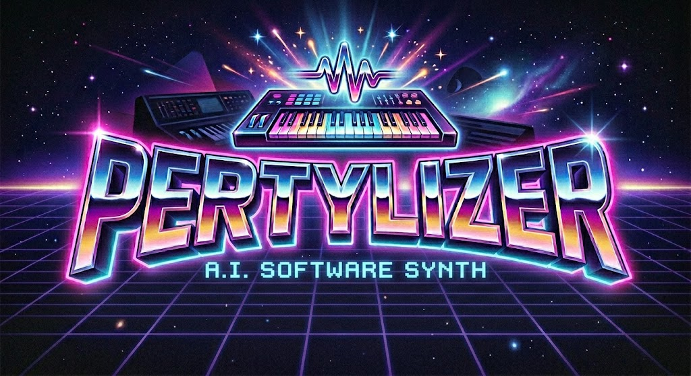

<p align="center">
  
</p>

# Pertylizer

[](https://github.com/pertyjons/pertylizer/actions/workflows/build.yml)

> **Disclaimer:** This application is primarily AI-generated (built with Claude Code). The author takes no
> responsibility whatsoever for anything — use entirely at your own risk.

A modular audio synthesizer written in Rust with a real-time egui GUI, pattern sequencer, spatial audio engine, 3D
visualizer, and **first-class AI-agent integration via MCP (Model Context Protocol)**.

## How This Came About

I started playing with AI to build synth sounds and modules over the winter break of 2025/2026. It began simply, and
I got sounds out surprisingly fast — so I figured it might be fun to have a little interface to make testing easier. It
quickly became clear that, together with Claude Code, you could build fairly advanced interfaces and signal routing in
no time. I fell for the [egui](https://github.com/emilk/egui) framework along the way: fast and very capable, maybe not
quite in line with today's reactive idioms — more bang-on, immediate-mode, a little last-century, which I rather like
:-)

Once the sound modules were in decent shape, I thought it would be fun to load old Amiga modules, play them back, and
see how they might be reimagined with a few more effects. I got reasonably far (there's a branch), but the more
complicated formats never turned out well, so I let that idea go. I've been tinkering since the turn of the year, and
the more you poke at something the more rabbit holes you fall into — there's always a new and interesting thing to
build or understand.

I've now reached a point where it might be worth making public, in case anyone else wants to poke around and play. I
know there are countless glitches and bugs, graphical bits that don't quite line up, and surely plenty of problems I'm
not even aware of. But the important things are in place: MIDI support, building sounds with rich effect chains, a room
simulation, a visualizer (which needs a *lot* more work :-) ), a sequencer, and a very simple sample bank. Take it for
what it is — an experiment of mine that happened to grow rather large, and that might bring some use or enjoyment to
someone out there. At the very least, I've learned a great deal — not just about Rust, but about audio programming and
visualization too.

A fair warning: there's no manual and barely any documentation yet. So if you give it a try, treat it as an
exploratory encounter — poke at things, see what happens, and discover how it works as you go :-)

## Highlights

A quick tour of what's inside — each item is described in more detail in its own section below.

- **Modular synthesis** — 67 module types and 25 effects, patched freely over a DAG-based audio graph with live cable
  visualization, plus 60 built-in patches to start from
- **Real-time GUI** — an immediate-mode egui interface for building instruments, wiring modules, and tweaking
  parameters while everything keeps playing
- **MIDI** — hardware MIDI input with velocity, pitch bend, mod wheel, and aftertouch
- **Acoustic World Engine** — physics-based spatial audio with room simulation, early reflections, late reverb, room
  modes, and per-voice 3D placement
- **Pattern sequencer** — pattern-based composition with song arrangement, real-time recording, and per-pattern
  automation lanes
- **Sample bank** — a simple sampler for importing, cropping, looping, and playing back your own samples
- **Audio input & recording** — record voice or live audio (mic/line-in) straight into the sample bank, or route the
  live input through an Audio Input module directly into a patch's module chain to process it with filters and effects
- **WAV export** — render your song offline (faster than real-time) to a WAV file at 16/24-bit or 32-bit float and
  44.1/48/96 kHz, with adjustable duration and reverb/delay tail
- **3D visualizer** — a separate Bevy app driven by OSC telemetry, with 27 audio-reactive effects, 11 scene presets,
  and 8 themes
- **AI integration** — ~120 MCP tools that let agents like Claude build, compose, and analyze right alongside you

## Examples

A good place to start poking around is [`assets/examples/`](assets/examples/), which ships with a handful of things
to load and pull apart:

- **`projects/`** — full songs you can open and play, from `Oxygene Dreams` and `Neon Horizon` to `Escape from
  Stockholm`, `Synth Pop a la Codex`, and a `Sidechain Demo`
- **`patches/`** — individual instrument sounds, such as `moog_resonant_sweep`, `hybrid_resonator`, and a
  `robot-from-hell-audio-input` patch that runs live audio input through the voice graph
- **`awe/`** — Acoustic World Engine room presets (e.g. `cave_perty`)

## Screenshots

See [`screenshots/README.md`](screenshots/README.md) for a visual tour of the patch editor, sequencer, Acoustic World
Engine, and 3D visualizer.

## Synthesis & Sound Design

At its core, Pertylizer is a modular synthesizer. Every instrument is a voice graph you wire by hand — typically
`oscillator → filter → amplifier → output` — with envelopes and LFOs modulating any parameter you route them to, all
feeding a per-instrument effect chain. You can start from one of the built-in patches or from an empty graph and build
up from scratch.

- **67 module types** — oscillators (standard, wavetable, additive, granular, fractal, FM/math, sub, LA synth, vector,
  pad synth, chaotic), filters (ladder, SVF, biquad, formant), envelopes, LFOs, MSEG, mod matrix, ring mod, drift
  generator, sampler, audio input, and more
- **25 effects** — delay, BBD delay, reverb, shimmer reverb, reverse gate reverb, chorus, ensemble chorus, flanger,
  phaser, univibe, distortion, waveshaper, compressor, limiter, EQ, tilt EQ, mid/side, crossover splitter, convolver,
  phase vocoder, vocoder, frequency shifter, granular FX, spectral blur, modal resonator
- **60 built-in patches** — from acid bass and grand piano to fractal cosmos and spectral freeze pad

### Signature capabilities

A handful of modules reach well past the usual subtractive toolkit:

- **Fractal Oscillator** — Weierstrass-function synthesis producing complex, evolving timbres
- **Granular Synthesis** — both as oscillator and real-time effect with grain cloud control
- **Spectral Processing** — phase vocoder, spectral blur, and partitioned convolution
- **Physical Modeling** — body resonance, mechanical noise, LA synth (bell/drum), modal resonator
- **Generative Sequencing** — Euclidean rhythm generator, Turing machine, random gates

## Acoustic World Engine (AWE)

Instead of a single algorithmic reverb, Pertylizer includes a physics-based room simulator. Sound is placed in a
virtual space, and the geometry and materials of that space shape what you hear — so reverb, reflections and resonance
all come from the same model rather than from separate boxes.

- Room simulation with selectable shapes and surface materials
- Early reflections via the image-source method
- Late reverb via a feedback delay network (FDN)
- Room modes (standing-wave resonances)
- Per-voice 3D spatialization, so individual notes occupy different positions
- Internal modulation LFOs for movement within the space

## Pattern Sequencer

Songs are built from patterns — short clips of notes and automation — placed on tracks along an arrangement timeline.
You can play parts in live or program them in the piano roll, loop sections while you work, and bounce the finished
result straight to disk.

- **Pattern-based sequencing** with song arrangement (960 PPQN)
- **Song repeat** — loops the entire song; transport repeat button in the toolbar
- **Pattern repeat** — loops an individual pattern during playback; toggle in the piano roll toolbar
- **Recording** — real-time MIDI recording with count-in, quantize grid, and overdub mode
- **Automation lanes** — per-pattern parameter automation
- **WAV export** — offline render of the full song to WAV, faster than real-time, with selectable bit depth (16/24-bit,
  32-bit float), sample rate (44.1/48/96 kHz), duration, and reverb/delay tail

## Sampling & Audio Input

Pertylizer isn't only synthetic — you can bring your own sound into the engine, whether from a file or straight off an
input.

- **Sample bank** — a simple sampler for importing, cropping, looping, and playing back your own samples
- **Audio input & recording** — monitor and record mic/line-in into the sample bank, or feed it live into a patch via
  the Audio Input module to process external sound through the voice graph and effects

## AI Integration via MCP

Pertylizer exposes **~120 MCP tools** that let AI agents (Claude Code, Claude Desktop, or any MCP-capable client)
build instruments, compose songs, edit patterns, set parameters, render and analyze audio, and play notes in real time
— all while the synth keeps running.

- **Streamable HTTP** on `http://127.0.0.1:9850/mcp` (enabled by default in GUI mode)
- **stdio** transport via `cargo run -- --headless`
- **Audio analysis tools** (`analyze_harmony`, `analyze_section`, `analyze_mix_bus`) give agents quantitative,
  deterministic feedback on harmony, mix balance, and per-track contribution
- **Auto-inference** (`get_instrument_profiles`) classifies instrument roles (drums/bass/lead/pad/pluck/FX) with
  confidence scores so agents can compose without manual tagging

See [`docs/README_MCP.md`](docs/README_MCP.md) for the full integration guide, tool catalog, and example workflows.

## Architecture

A few principles hold the whole thing together:

- **Modular patching** — connect modules freely via a DAG-based audio graph with cable visualization
- **Multitimbral** — per-instrument voice allocation and effect chains
- **Real-time safe** — lock-free audio thread with zero allocations, locks, or panics
- **MIDI** — hardware MIDI input with velocity, pitch bend, mod wheel, aftertouch
- **Audio input** — monitor and record mic/line-in into the sample bank, or feed it live into a patch via the Audio
  Input module to process external sound through the voice graph and effects
- **OSC telemetry** — real-time spectrum, RMS, note events, and transport state streamed over UDP at 30 Hz (enabled by
  default, `--no-osc` to disable) — this is what drives the 3D visualizer

## 3D Visualizer

A separate application (`visualizer/`) that receives OSC telemetry from the synth and renders real-time 3D visuals
driven by audio analysis. It runs as its own binary, so the synth stays lean whether or not you use it.

### Visual Effects (27 effects)

Effects are organized into layered scene slots:

| Slot           | Effects                                                                                                                                |
|----------------|----------------------------------------------------------------------------------------------------------------------------------------|
| **Terrain**    | Base Floor, FFT Bars, Waveform Ring, Spectral Waterfall, Pulse Terrain, Spectral Origami, Phase Rings, Voronoi Shatter, FFT Terrain, Cyber Wireframe |
| **Hero**       | CPU Overdrive Core, Flux Supernova, Fractal Pulse, Ferrofluid Tendrils, Note Tree, Orbital Satellites                                  |
| **Ambient**    | Centroid Nebula, Spectral Cathedral, Reaction Diffusion, Spectral Aurora                                                               |
| **Transients** | Note Particles, Velocity Meteors, Harmonic Ribbons, Chord Bloom, Neon Calligraphy, Instrument Cubes, Beat Fracture                     |

### Scene Presets (11 presets)

0. **Classic Pertylizer** — Spectral Waterfall + Note Particles
1. **The Matrix** — Pulse Terrain + CPU Overdrive + Centroid Nebula + Velocity Meteors
2. **Sacred Geometry** — Spectral Origami + Fractal Pulse + Spectral Cathedral + Chord Bloom
3. **Magnetic Storm** — Waveform Ring + Ferrofluid Tendrils + Centroid Nebula + Phase Rings + Harmonic Ribbons
4. **The Exploding Sun** — FFT Bars + Flux Supernova + Neon Calligraphy + Note Particles
5. **Metallic Orchestra** — Base Floor + Fractal Pulse + Centroid Nebula + Instrument Cubes
6. **Earthquake** — Voronoi Shatter + Ferrofluid Tendrils + Velocity Meteors + Note Particles
7. **Spectrum City** — FFT Terrain + Note Tree + Reaction Diffusion + Chord Bloom
8. **Living Forest** — Pulse Terrain + Note Tree + Centroid Nebula + Harmonic Ribbons + Note Particles
9. **Neon Grid** — Cyber Wireframe + Orbital Satellites + Spectral Aurora + Beat Fracture
10. **Arctic Station** — Cyber Wireframe + Flux Supernova + Spectral Aurora + Note Particles + Beat Fracture

### Themes (8 themes)

Neon (default), Metal, Glass, Space, Synthwave, Ember, Arctic, Void

### Camera Modes (5 modes)

Orbit (default), Top-Down, Front, Fly-Through, Free Orbit

- Dolly-zoom triggers automatically on bass drops
- Auto-cut cycles through camera modes every ~20 seconds

### Debug HUD

Press `H` to show a semi-transparent overlay with:

- **Visuals** — active theme, camera mode, auto-cut state, scene composition (terrain/hero/ambient/transients)
- **Audio analysis** — RMS levels, peak levels, spectral centroid (Hz), spectral flux
- **Transport** — BPM, beat position, beat phase, voice count
- **Performance** — FPS, frame time (ms), CPU usage, event drops, data staleness
- **Technical** — FFT bin count, OSC protocol version

### Running the Visualizer

```bash
# Start the synth first (OSC telemetry enabled by default)
cargo run

# In another terminal, start the visualizer
cd visualizer && cargo run
```

## Keyboard Shortcuts

### Synth

| Key                     | Action                    |
|-------------------------|---------------------------|
| `Z` – `M`               | Play notes (C3–B3)        |
| `Q` – `I`               | Play notes (C4–C5)        |
| `2`, `3`, `5`, `6`, `7` | Black keys (sharps/flats) |
| `-` / `+`               | Shift octave down / up    |

### Visualizer

| Key              | Action                                           |
|------------------|--------------------------------------------------|
| `Left` / `Right` | Previous / next scene preset                     |
| `Up` / `Down`    | Zoom in / out                                    |
| `R`              | Random scene (procedurally generated)            |
| `T` / `Shift+T`  | Next / previous theme                            |
| `C` / `Shift+C`  | Next / previous camera mode                      |
| `V`              | Toggle auto-cut (cycles camera modes every ~20s) |
| `F`              | Toggle fullscreen                                |
| `P`              | Save screenshot (PNG)                            |
| `H`              | Toggle debug HUD                                 |

## Tech Stack

- **Language:** Rust 1.95+ (edition 2024)
- **Audio:** cpal (cross-platform I/O)
- **GUI:** egui/eframe with custom knobs, meters, scopes, and spectrum analyzer
- **MIDI:** midir
- **DSP:** PolyBLEP oscillators, SVF/biquad/ladder filters, FFT via realfft
- **MCP:** rmcp + axum (Streamable HTTP on port 9850)
- **OSC:** rosc (Open Sound Control over UDP)
- **Visualizer:** Bevy 0.18 (3D rendering)
- **Concurrency:** lock-free ringbuf, parking_lot

## Building & Running

```bash
# Build
cargo build

# Run with GUI (MCP + OSC telemetry enabled by default)
cargo run

# Run without OSC telemetry
cargo run -- --no-osc

# Run headless (no GUI, MCP server on stdio)
cargo run -- --headless

# Tests, lints, formatting
cargo test && cargo clippy --all-targets && cargo fmt --check
```

## Workspace Crates

| Crate                | Description                                                  |
|----------------------|--------------------------------------------------------------|
| `synth_core`         | Domain types, module traits, audio abstractions              |
| `synth_dsp`          | DSP primitives: oscillators, filters, delay lines, FFT       |
| `synth_awe`          | Acoustic World Engine — spatial audio & room simulation      |
| `synth_sampler`      | Sample loading, playback, and waveform analysis              |
| `synth_sequencer`    | Pattern and song sequencing                                  |
| `synth_modules`      | 67 module types including 25 effects                         |
| `synth_engine`       | Audio engine: voice allocation, modular graph, mixing        |
| `synth_mcp`          | MCP server with ~120 tools for AI agent integration          |
| `synth_osc`          | OSC telemetry sender (spectrum, notes, transport over UDP)   |
| `synth_osc_protocol` | Shared OSC protocol definitions for synth and visualizer     |
| `pertylizer`         | Main application: GUI, audio I/O, MIDI                       |
| `visualizer`         | Bevy 3D visualizer driven by OSC telemetry (separate binary) |
