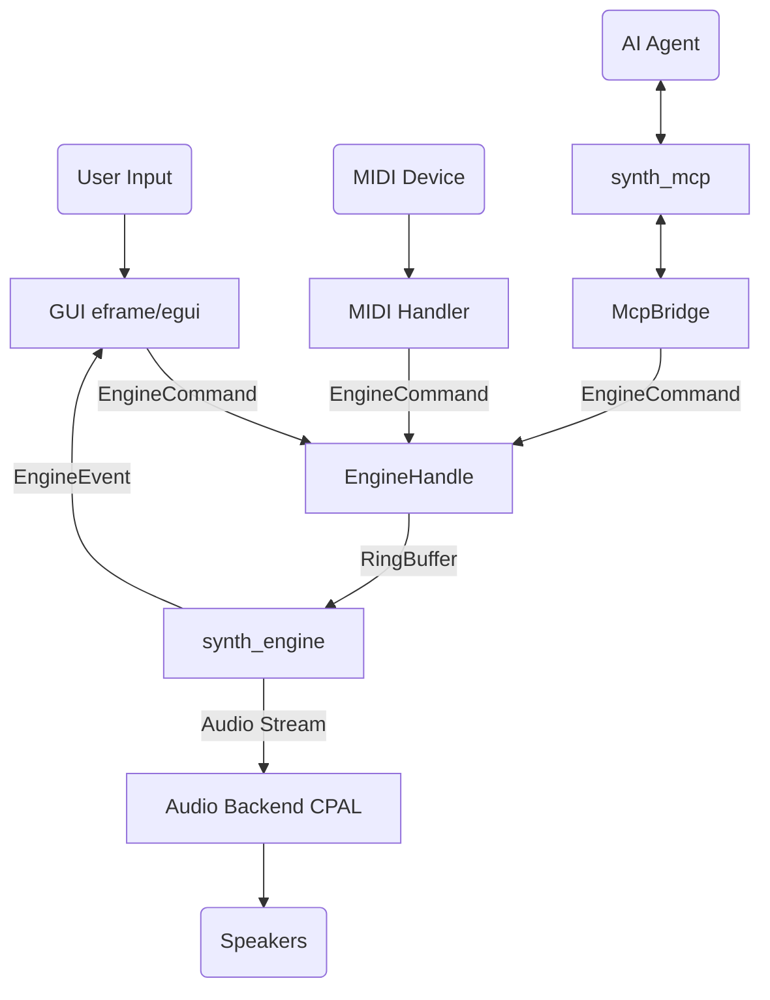

# modular_synth

Detta är huvudapplikationen (entry point) för den modulära synthesizern. Kraten knyter samman alla underliggande bibliotek till en fungerande applikation med grafiskt gränssnitt, ljudhantering och MIDI.

## För människor

`modular_synth` innehåller:
- **GUI:** Ett eframe/egui-baserat gränssnitt (`src/gui/`) med visuella kablar, rack-vy, och parametrar.
- **Audio I/O:** Abstraktion för ljuduppspelning (främst via `cpal`).
- **MIDI I/O:** Hantering av MIDI-enheter via `midir`.
- **Patch Management:** Funktionalitet för att spara, ladda och hantera synth-patchar (`src/patch.rs`, `src/patches/`).
- **MCP Bridge:** Brygga för Model Context Protocol som tillåter AI-agenter att styra synthen (`src/mcp_bridge.rs`).

Applikationen startas antingen med GUI (standard) eller ett konsol-gränssnitt (`--gui console`).

## For AI Agents

This crate acts as the integration layer and application host.
- `src/main.rs` initializes the audio host, creates the `SynthEngine`, and spawns the GUI or MCP server.
- `src/gui/` contains all egui rendering logic, utilizing a patch editor for connecting modules visually.
- `src/patch.rs` defines the serializable patch format.
- Communication with the audio thread is done via `EngineHandle` and `CommandSender` (lock-free ring buffers).

## Arkitektur / Flöde

