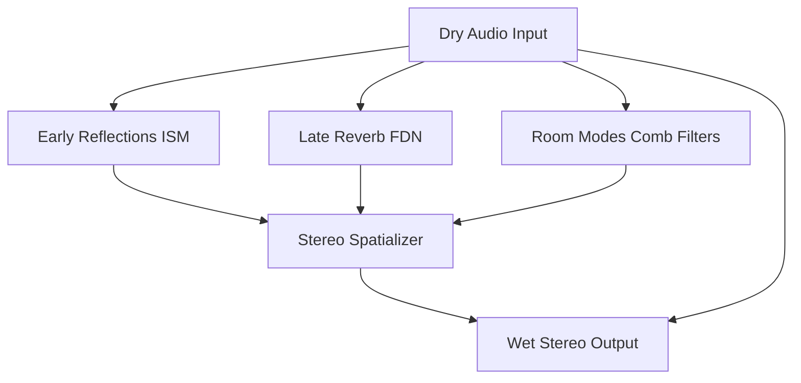

# synth_awe (Acoustic World Engine)

Acoustic World Engine (AWE) är ett system för realtids-rumssimulering och avancerade akustiska miljöer, implementerat som ett post-processing-steg efter master-effekterna.

## För människor

AWE simulerar hur ljud beter sig i ett fysiskt (eller magiskt/utomjordiskt) rum. Istället för ett klassiskt reverb anger du rummets form, storlek, material på väggarna, samt var ljudkällan och lyssnaren befinner sig.
- **Tidiga reflektioner:** Beräknas via Image Source Method (ISM).
- **Sen efterklang:** Genereras via ett Feedback Delay Network (FDN).
- **Rumsmoder:** Stående vågor simuleras för att ge rummet karaktär.
- **Spatialisering:** Positionerar ljudet i stereo beroende på var källan är.

## For AI Agents

AWE provides physical room modeling. It takes dry mono/stereo signals and processes them into spatialized wet signals.
- `AweEngine`: Main processor, implements early reflections + late reverb + modes + spatialization.
- `RoomShape` & `Material`: Defines the geometry and frequency-dependent absorption.
- Internal LFOs (`lfo.rs`) can modulate parameters like room size or source position at control-rate.

## Arkitektur / Flöde

