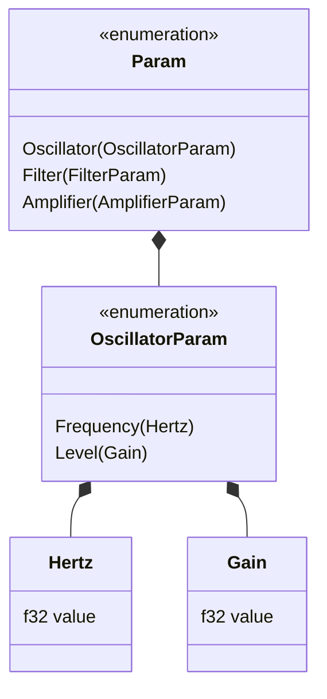

# synth_core

Denna crate utgör grunden för hela synthesizer-projektet. Här definieras alla gemensamma typer, trait-gränssnitt och parametrar.

## För människor

Här tillämpas **Newtype-mönstret** (t.ex. `Hertz`, `Gain`, `Seconds`) för att göra koden extremt typsäker. Du kan inte råka skicka ett tidsvärde till en frekvens-parameter. 
Den innehåller också:
- `PolyModule`: Interfacet för alla röst-moduler (oscillatorer, filter, etc.).
- `AudioEffect`: Interfacet för alla effekter (reverb, delay, etc.).
- Parameter-beskrivningar som GUI:t använder för att bygga reglage automatiskt.

## For AI Agents

This is the most critical dependency. ALMOST ALL crates depend on `synth_core`.
- Heavily relies on newtypes (`src/types/`) to prevent "boolean blindness" and primitive obsession.
- Enums like `Param` and `ModuleType` are defined here (`src/params/`).
- `PolyModule` uses `InputPorts` (a zero-allocation wrapper) for real-time safe audio graph routing.

## Typsäkerhets-exempel

