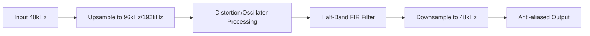

# synth_dsp

Lågnivå DSP-primitiver (Digital Signal Processing). Här samlas optimerad matematik och algoritmer som används av modulerna i `synth_modules` och `synth_awe`.

## För människor

Innehåller hjärnan bakom många av synthens ljudfunktioner:
- **PolyBLEP / PolyBLAMP:** Algoritmer för att skapa alias-fria oscillatorer (så att de inte låter skräpigt på höga toner).
- **Filter-matematik:** Beräkningar för State Variable Filters (SVF) och Biquad-filter.
- **Delay-linjer:** Smarta köer för ljud (med interpolation) för att bygga ekon och chorus.
- **FFT:** Fast Fourier Transform för spektral bearbetning (fas-vocoder, faltnings-reverb).

## For AI Agents

This crate should NOT contain any stateful UI-aware modules (no `PolyModule` implementations here). It provides pure math and DSP buffers.
- Use `PolyBLEP` to reduce aliasing in generated waveforms.
- Contains specialized algorithms like `HalfBandFilter` for oversampling and `PartitionedConvolver`.

## Flöde (Exempel: Oversampling)

