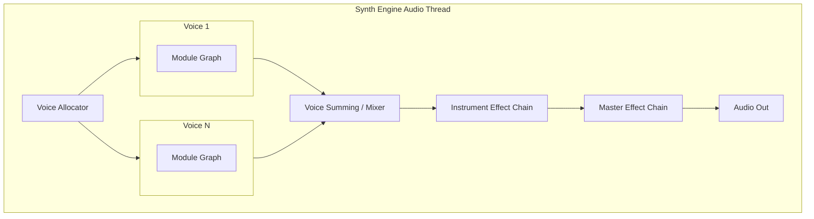

# synth_engine

Motorn som driver uppspelningen. Här hanteras röstallokering, grafrutning och MIDI-händelser i realtid.

## För människor

När du trycker på en tangent på ditt MIDI-keyboard är det `synth_engine` som:
1. Hittar en ledig röst (Voice Allocator).
2. Talar om för alla moduler i den rösten att en ny ton har startats.
3. Kör ljudet genom modulgrafen (från Oscillator till Output).
4. Skickar det sammanslagna ljudet genom master-effekterna (Effect Chain).
5. Beräknar ljudnivåer för mätarna (Metering).

## For AI Agents

The `SynthEngine` runs on the real-time audio thread.
- `src/voice_allocator.rs`: Manages polyphony, voice stealing, mono/legato logic.
- `src/graph.rs`: Topological sorting of modules and executing `PolyModule::process` in the correct order.
- `src/commands.rs`: Lock-free communication from UI to Engine using `EngineCommand`.
- **CRITICAL:** Code running in the audio thread (e.g. `process()`) MUST NOT allocate memory, lock mutexes, or block.

## Arkitektur

