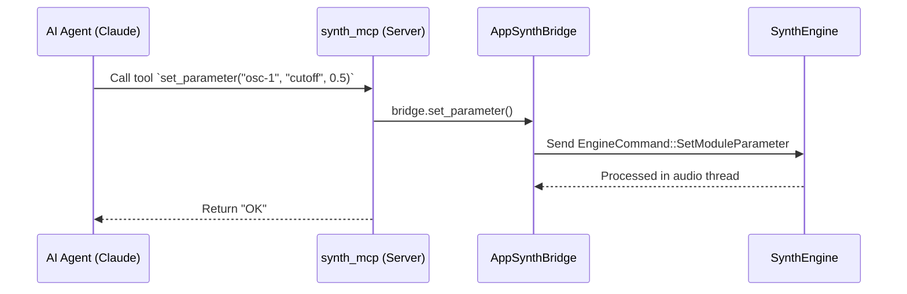

# synth_mcp

MCP (Model Context Protocol) Server för synthen. Detta möjliggör fjärrstyrning och inspektion av synthesizer-motorn från AI-agenter (som Claude).

## För människor

Med denna modul aktiverad kan AI-verktyg "prata" med synthen medan den körs. De kan se hur dina moduler är kopplade, ändra parametrar (t.ex. "öka resonansen på filtret"), ladda exempel-patchar eller spela MIDI-toner – allt utan att du behöver klicka i gränssnittet.

## For AI Agents

This crate implements the `ServerHandler` using the `rmcp` library.
- Exposes tools like `list_modules`, `get_parameter`, `set_parameter`, `connect`, `note_on`.
- Uses `SynthBridge` trait to communicate with the app without knowing `synth_engine` types directly.
- Standard protocol for AI to interact with the runtime state.

## MCP Flöde

