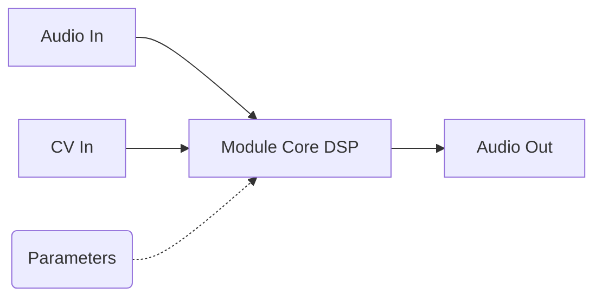

# synth_modules

Här finns alla faktiska moduler (byggstenarna) som användaren kan lägga till i sin synthesizer-patch.

## För människor

Det här är din samling av synthesizer-komponenter:
- **Ljudkällor:** `Oscillator` (Saw, Square, Sine), `NoiseGenerator`, `WavetableOsc`, `MathOscillator`.
- **Modifierare:** `Filter`, `Amplifier`, `RingMod`.
- **Modulation:** `Lfo`, `Envelope` (ADSR), `Mseg`, `KineticModulator`.
- **Effekter:** `Delay`, `Reverb`, `Chorus`, `Distortion`, osv.
- **Generativt:** `Euclidean`, `TuringMachine`, `RandomGates`.

Varje modul deklarerar sina egna ingångar, utgångar och parametrar via `Describable`-tratet.

## For AI Agents

Implementations of `PolyModule` and `AudioEffect`.
- `process` method must be highly optimized, utilizing algorithms from `synth_dsp`.
- Module parameter fetching/setting is done via the strongly typed `Param` enum from `synth_core`.
- Zero-allocation port processing using `InputPorts`.

## Generisk Modul Struktur

