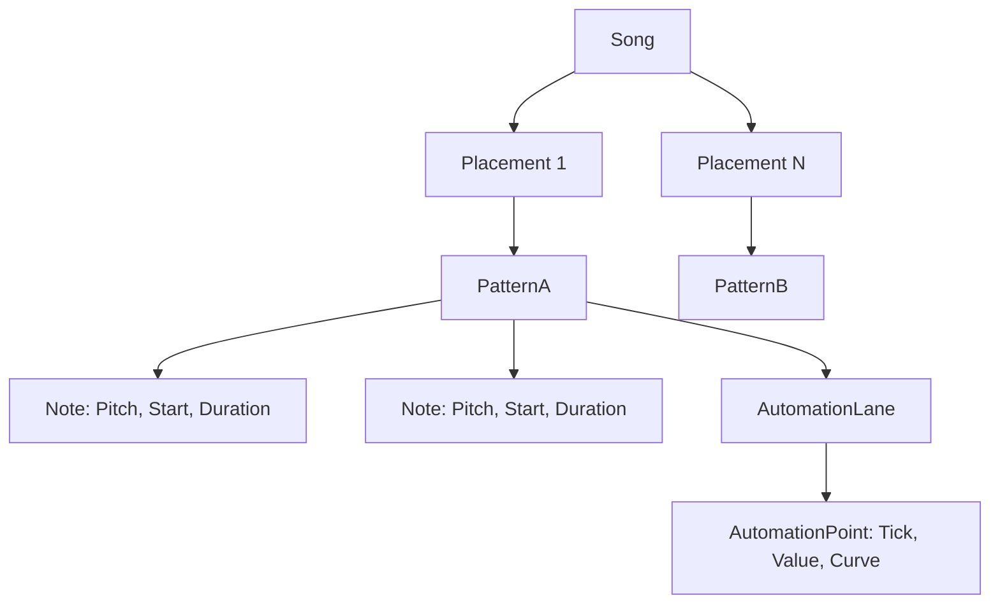

# synth_sequencer

Ett inbyggt sequencersystem för att komponera låtar, mönster (patterns) och hantera automation över tid.

## För människor

Istället för att bara spela live via MIDI kan du här bygga upp låtar.
- **Notes:** Toner lagras med en starttid och en duration (längd).
- **Patterns:** Grupper av toner, t.ex. ett 16-stegs trumkomp eller en basgång.
- **Automation:** Spela in och spela upp parameterändringar (t.ex. ett långsamt filter-sweep).
- **Song:** Arrangerar patterns i en tidslinje, inklusive tempoförändringar.

## For AI Agents

Handles abstract musical time (960 PPQN - Pulses Per Quarter Note).
- Converts static `Note` structs into dynamic `SequencerEvent` (NoteOn/NoteOff) during real-time playback.
- `SequencerEngine` translates ticks into sample-accurate events for the `SynthEngine`.
- Supports complex interpolation for automation points (Linear, Step, Exponential, SCurve).

## Sequencer Hierarki

