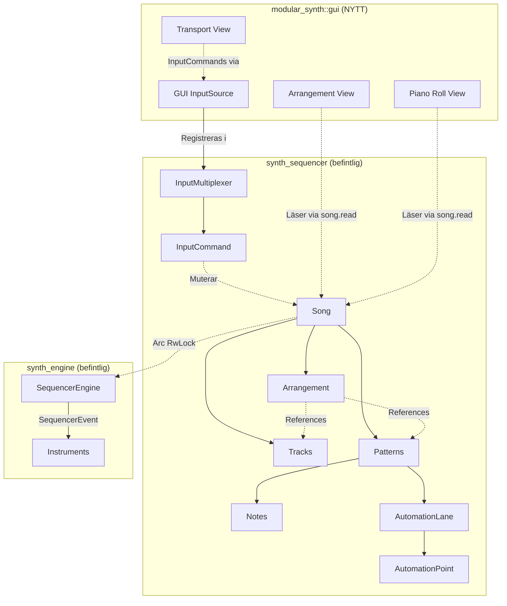
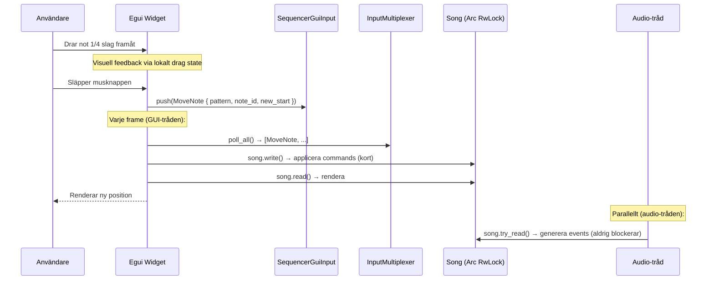

# Sequencer GUI Architecture Plan

## 1. Systemöversikt

Sequencer-infrastrukturen är redan implementerad i `synth_sequencer`-craten med en komplett datamodell (`Song`, `Pattern`, `Track`, `Note`, `AutomationLane`), ett kommando-system (`InputCommand` med 50+ operationer), och en realtids-uppspelningsmotor (`SequencerEngine`). **Det som saknas är GUI:t.**

GUI:t ska agera som en vy och redigerare över det befintliga tillståndet. Alla mutationer sker via `InputCommand`-kön; GUI:t läser enbart data under rendering.



## 2. Befintlig infrastruktur

Dessa komponenter finns redan och ska användas direkt — inte designas om.

### Filer och plats

| Komponent | Fil | Status |
|-----------|-----|--------|
| Song, Pattern, Track, Note | `crates/synth_sequencer/src/{song,pattern,track,note}.rs` | Klar |
| Tick, PatternTick, Duration | `crates/synth_sequencer/src/time.rs` | Klar |
| PatternId, TrackId, NoteId | `crates/synth_sequencer/src/ids.rs` | Klar |
| Pitch, Velocity | `crates/synth_sequencer/src/pitch.rs` | Klar |
| AutomationLane, CurveType | `crates/synth_sequencer/src/automation.rs` | Klar |
| InputCommand (50+ operationer) | `crates/synth_sequencer/src/input.rs` | Klar |
| InputMultiplexer, InputSource | `crates/synth_sequencer/src/input.rs` | Klar |
| SequencerEngine | `crates/synth_engine/src/sequencer_engine.rs` | Klar |
| SequencerDebugger | `crates/modular_synth/src/debug/sequencer_debugger.rs` | Klar |
| SequencerEvent | `crates/synth_sequencer/src/events.rs` | Klar |
| MCP Song-access | `crates/modular_synth/src/mcp_shared.rs` | Klar |

### InputCommand — redan implementerade operationer

GUI:t ska mappa användarinteraktioner till dessa befintliga kommandon:

- **Transport:** `Play`, `Stop`, `Pause`, `TogglePlayPause`, `SetPosition(Tick)`, `GoToStart`, `GoToEnd`, `StepPosition(i64)`
- **Not-redigering:** `AddNote`, `RemoveNote`, `MoveNote`, `ResizeNote`, `TransposeNote`, `SetNoteVelocity`
- **Selektion:** `SelectNotes`, `SelectRange`, `AddToSelection`, `ClearSelection`, `SelectAll`
- **Clipboard:** `DeleteSelection`, `CopySelection`, `CutSelection`, `PasteAt`, `DuplicateSelection`
- **Kvantisering:** `Quantize`, `QuantizeSelection`
- **Bulk:** `TransposeSelection`, `ScaleVelocities`, `Humanize`
- **Loop:** `SetLoop`, `ToggleLoop`, `LoopSelection`
- **Tempo:** `SetTempo`, `TapTempo`, `SetTimeSignature`
- **Pattern:** `CreatePattern`, `DeletePattern`, `DuplicatePattern`, `RenamePattern`
- **Undo:** `Undo`, `Redo`
- **Record:** `ToggleRecord`

### InputMultiplexer — integration

`InputMultiplexer` multiplexar input från flera källor (keyboard, MIDI, GUI). GUI:t ska registrera en egen `InputSource` via `InputMultiplexer::add_source()`:

```rust
pub struct SequencerGuiInput {
    pending: Vec<InputCommand>,
    enabled: bool,
}

impl InputSource for SequencerGuiInput {
    fn poll(&mut self) -> Vec<InputCommand> {
        std::mem::take(&mut self.pending)
    }
    fn name(&self) -> &str { "sequencer_gui" }
    fn is_active(&self) -> bool { !self.pending.is_empty() }
    fn is_enabled(&self) -> bool { self.enabled }
    fn set_enabled(&mut self, enabled: bool) { self.enabled = enabled; }
}
```

### Song-access via Arc\<RwLock\<Song\>\>

`Song` delas redan som `Arc<RwLock<Song>>` i:
- `SequencerEngine` (läser under audio processing)
- `McpSharedState` (MCP-tråden läser/skriver)

GUI:t ska använda samma `Arc<RwLock<Song>>` via `SynthApp`. Detaljer i sektion 4.1.

**OBS:** `std::sync::RwLock` är inte RT-säkert — se sektion 5.2 för migreringsplan till `try_read()`.

## 3. Datastrukturer & Typer

Alla tidpunkter hanteras internt i **Ticks** (960 PPQN). Detta ger extrem noggrannhet och frikopplar musikalisk tid från ljudtrådens samplingshastighet.

- **Absolut tid (`Tick`)**: Global position i låten (används i `Song`, `PatternPlacement`).
- **Relativ tid (`PatternTick`)**: Position inuti ett pattern (används i `Note`, `AutomationPoint`).
- **Identiteter**: Strikt typade (`PatternId`, `TrackId`, `NoteId`). GUI:t *måste* behålla dessa — inte direkta pekare — för att tåla asynkrona uppdateringar via MCP.
- **NoteId-scope**: `NoteId` är unik *inom* ett pattern (tilldelad av `Pattern::next_note_id`), men **inte globalt unik**. GUI-selektion måste därför lagra `(PatternId, NoteId)`-par.
- **Note.duration = None**: Betyder "open-ended" — noten sustains tills manuell `NoteOff`. I Piano Roll renderas som en pil/open-ended rektangel utan höger avgränsning. Resize-operationer på sådana noter sätter en explicit duration.

### Entitets-karta för GUI

| Entitet | Beskrivning | Nyckelegenskaper för rendering |
|:--------|:------------|:-------------------------------|
| `Song` | Global container | `default_tempo` (Bpm), `default_time_signature`, `tempo_changes`, `time_signature_changes` |
| `SequencerTrack` | En kanal | `name`, `color` (TrackColor), `mute`/`solo`, `volume`/`pan` (NormalizedValue), `instrument` (Option\<SeqInstrumentId\>) |
| `PatternPlacement` | Block i arrangement | `start` (Tick), `track_id`, `pattern_id`, `transpose` (Semitones), `gain` |
| `Pattern` | Innehåll | `length` (Duration), `row_resolution` (RowResolution), `notes`, `automation` |
| `Note` | Enskild not | `start` (PatternTick), `duration` (Option\<Duration\>), `pitch` (Pitch 0-127), `velocity`, `instrument` (SeqInstrumentId) |
| `AutomationLane` | Param-kurva | `target` (AutomationTarget), `points` (sorterade AutomationPoint) |
| `AutomationPoint` | Nod i kurva | `tick` (PatternTick), `value` (0.0-1.0), `curve` (CurveType: Linear/Step/Exponential/SCurve) |
| `TempoChange` | Tempoändring | `tick` (Tick), `tempo` (Bpm) |
| `TimeSignatureChange` | Taktartsändring | `tick` (Tick), `time_signature` |

### SeqInstrumentId ↔ InstrumentId mapping

`SeqInstrumentId(u16)` mappas idag till `SynthEngine`s instrument-array via `instrument.0 as usize` (se `route_sequencer_events()` i `synth_engine.rs:1778`). **Detta är instabilt vid borttagning/omordning av instrument** — index förskjuts och noter hamnar på fel instrument.

**Lösning — stabil mappningstabell (Fas 0):**

```rust
/// Bidirectional map between sequencer and engine instrument IDs.
struct InstrumentMapping {
    /// SeqInstrumentId → InstrumentId (stable, survives reorder)
    seq_to_engine: HashMap<SeqInstrumentId, InstrumentId>,
    /// InstrumentId → SeqInstrumentId (reverse lookup)
    engine_to_seq: HashMap<InstrumentId, SeqInstrumentId>,
    next_seq_id: u16,
}
```

Vid instrument-skapande tilldelas ett stabilt `SeqInstrumentId`. Vid borttagning tas entry bort — befintliga noter/automation behåller sitt ID men renderas som "orphaned". Vid `route_sequencer_events()` görs lookup i tabellen istället för index-cast.

## 4. Vy-komponenter (Arkitektur)

### A. AppView-integration

Ny `AppView::Sequencer`-variant i `crates/modular_synth/src/gui/app/state.rs`:

```rust
pub enum AppView {
    #[default]
    Rack,
    AcousticWorld,
    Sequencer,  // NY
}
```

Transport-panelen renderas alltid (oavsett aktiv vy) som en tunn bar i toppen/botten. Arrangement- och Piano Roll-vyerna visas när `AppView::Sequencer` är aktivt.

### B. SynthApp-tillägg

```rust
struct SynthApp {
    // ... befintliga fält ...

    // Sequencer (NYTT)
    song: Arc<RwLock<Song>>,
    sequencer_gui_input: Arc<Mutex<SequencerGuiInput>>,
    sequencer_view_state: SequencerViewState,
}
```

`song` skapas vid app-start och skickas till engine via `EngineCommand::SetSong`. Samma `Arc` delas med MCP.

### C. View State (Lokalt GUI-tillstånd)

Tillstånd som bara rör rendering, inte musiken:

```rust
struct SequencerViewState {
    // Zoom och scroll
    zoom_x: f32,              // Ticks per pixel
    zoom_y_arrange: f32,      // Pixels per track
    zoom_y_piano: f32,        // Pixels per semiton
    scroll_x: f32,
    scroll_y: f32,

    // Selektion
    selected_pattern: Option<PatternId>,
    selected_notes: HashSet<(PatternId, NoteId)>,

    // Drag state (Edit Transactions, se 4.2)
    drag: Option<DragState>,

    // Piano Roll visible?
    piano_roll_open: bool,
}
```

### D. Transport Control

Hanterar globalt tillstånd och tid. Renderas alltid synlig.
- **Visar:** Aktuell uppspelningsposition via `SequencerEngine::current_tick()` → konverteras till `Bar:Beat:Tick` via `TimeSignature`.
- **Kommandon:** Triggar befintliga `InputCommand::Play`, `Stop`, `SetPosition`, `SetTempo` etc.

### E. Arrangement View (Låtvy)

X-axel: Absolut tid `Tick`. Y-axel: `TrackId`.

- **Tracks (vänsterpanel):** Lista av tracks med namn, `mute`/`solo`-knappar, volym, `color`.
- **Grid:** Taktstreck baserat på `Song::time_signature_at(tick)`. Grid-linjer ritas i tick-space (musikalisk tid) — tempo påverkar inte positionen av taktstreck. En sekundär tidsaxel (sekunder) kan visas som komplement men kräver tempo-interpolation.
- **Placements (main canvas):** Rektanglar för `PatternPlacement`. Bredd härleds direkt från refererat Pattern's `length`. **OBS:** Ändring av ett patterns längd påverkar alla placements som refererar det — detta är medveten "live reference"-semantik, inte clip/trim.
- **Prestanda/Culling:** Använd `Song::placements_in_range(start_tick, end_tick)` för att bara rita det som syns.

### F. Piano Roll View (Patternvy)

Öppnas vid dubbelklick på ett PatternPlacement i Arrangement.

X-axel: Relativ tid `PatternTick`. Y-axel: `Pitch`.

- **Grid:** Baserat på `RowResolution` (t.ex. 16-delsnoter).
- **Note canvas:** Rita `Note` baserat på `start` och `duration`. Y-position från `pitch`. Noter med `duration = None` renderas som open-ended (pil/fading rektangel).
- **Instrument-per-note och "effektivt instrument":** Noter färgkodas baserat på det *effektiva* instrumentet — d.v.s. track-instrumentet om satt, annars `note.instrument`. Om track-instrument overridar, visas en tydlig indikator (t.ex. `[Track: Bass]` i toolbaren) och noterna renderas i track-instrumentets färg. Toolbar-väljaren "Draw Inst" bestämmer `note.instrument` för nya noter.
- **Velocity-zon:** Nedre panel visar velocity-staplar för selekterade noter eller `AutomationLane`.
- **Prestanda/Culling:** Använd `Pattern::notes_in_range(start, end)`.

## 5. State Management & Input Handling

### 5.1 Dataflöde



### 5.2 Trådsäkerhet

**Tre trådar accessar Song:**

| Tråd | Typ | Metod | Frekvens |
|------|------|-------|----------|
| Audio | read | `collect_events_at_tick()`, `update_cached_tempo()` | Per tick (~960× per beat) |
| GUI (egui) | read | Rendering av arrangement/piano roll | 60 fps |
| MCP/GUI command | write | `set_song_tempo()`, `add_note()` etc. | Sporadisk |

**Känt RT-säkerhetsproblem:** `std::sync::RwLock` på Linux (glibc pthread) ger pending writers prioritet. Om MCP/GUI gör `song.write()` medan audio-tråden väntar på `song.read()`, blockeras audio-tråden tills write-låset släpps. Detta kan ge xruns.

**Lösning — `try_read()` på audio-tråden (Fas 0):**

```rust
// I SequencerEngine::collect_events_at_tick():
let Ok(song) = self.song.try_read() else {
    // Write pågår — hoppa över denna tick, inga events genereras.
    // Nästa tick (vanligtvis <1ms senare) försöker igen.
    return;
};
```

`try_read()` blockerar aldrig — returnerar `Err` om ett write-lock hålls. Audio-tråden missar då en tick (~0.5ms vid 120 BPM). Samma approach för `update_cached_tempo()`.

**Varför detta räcker:**
- Write-locks (MCP/GUI) hålls i mikrosekunder (ändra ett fält, push till Vec)
- Audio missar maximalt 1-2 ticks per write — ohörbart
- Ingen `Mutex`, ingen busy-wait, inga allokeringar på audio-tråden
- Befintlig `cached_tempo` minskar redan antalet låsningar

**Kommando-serialisering:**

Alla `Song`-mutationer (GUI, MCP, MIDI) serialiseras via **en gemensam command-kö** som konsumeras på GUI-tråden:

```
GUI-tråd (varje frame):
  1. commands = input_multiplexer.poll_all()  // Samlar från alla InputSources
  2. for cmd in commands { song.write() → applicera }  // Kort write-lock
  3. song.read() → rendera                             // Lång read-lock (ok)
```

MCP integreras genom att registrera en MCP `InputSource` som buffrar kommandon istället för att göra `song.write()` direkt. Detta eliminerar race conditions och ger deterministisk ordning.

**OBS:** `InputMultiplexer` pollas **enbart på GUI-tråden** — aldrig på audio-tråden. Audio-tråden gör enbart `try_read()`.

**Framtida optimering (om behov uppstår):** Byt till `arc_swap::ArcSwap<Song>` med copy-on-write. GUI/MCP klonar, muterar, och swapar atomärt. Audio-tråden gör `song.load()` utan lås. Krävs troligen inte — `try_read()` räcker för nuvarande storlek på Song-data.

### 5.3 Edit Transactions (Undo-säkert)

Under drag-operationer genereras INTE en `InputCommand` varje frame:

1. **Mouse down:** Spara `drag_start_tick` och `drag_start_pitch` i lokalt `DragState`.
2. **Under drag:** Rita noter med tillfällig offset. Enbart visuellt — Song muteras inte.
3. **Mouse up:** Beräkna total skillnad, kvantisera via `RowResolution::quantize()`, skicka ETT `InputCommand::MoveNote` (eller `ResizeNote`, `SetNoteVelocity` etc.).

## 6. GUI Mockups

### 6.1 Transport Control (alltid synlig)

```text
+--------------------------------------------------------------------------------+
| [ |< ] [ << ] [  PLAY  ] [ >> ] [ REC ]   |  Pos: 004:02:480  |  Tempo: 120  |
+--------------------------------------------------------------------------------+
```

### 6.2 Arrangement View (Låtvy)

Huvudvy i `AppView::Sequencer`. Vänster sida: spår. Höger: tidslinje.

```text
+----------------------+---------------------------------------------------------+
| TRACKS               |  BAR 1      | BAR 2       | BAR 3       | BAR 4         |
|                      |  |   .   .  |  |   .   .  |  |   .   .  |  |   .   .    |
+----------------------+--v------------------------------------------------------+
| [T1] Drums           |  +-------+  +-------+     +-------+                     |
| Vol:[====  ] [M][S]  |  | Ptn 1 |  | Ptn 1 |     | Ptn 2 |                     |
|                      |  +-------+  +-------+     +-------+                     |
+----------------------+---------------------------------------------------------+
| [T2] Bass            |             +-------------------+                       |
| Vol:[======] [M][S]  |             | Ptn 3 (Bassline)  |                       |
|                      |             +-------------------+                       |
+----------------------+---------------------------------------------------------+
| [T3] Lead            |                                         +-------+       |
| Vol:[====  ] [M][S]  |                                         | Ptn 4 |       |
|                      |                                         +-------+       |
+----------------------+---------------------------------------------------------+
```

- **X-axel:** `Tick` (absolut låttid).
- **Y-axel:** `TrackId`.
- **Block:** `PatternPlacement` (visar pattern-namn, färgkodas efter track-färg).

### 6.3 Piano Roll (Pattern-editor)

Öppnas vid dubbelklick på PatternPlacement. Dockad i nedre halvan.

```text
+--------------------------------------------------------------------------------+
| [X] Close  |  Pattern: 'Ptn 1'  |  Draw Inst: [Synth A v]  |  Length: [4 Bars]|
+----------+---------------------------------------------------------------------+
| PITCH    |  1.1     1.2     1.3     1.4     2.1     2.2     2.3     2.4        |
|          |  |   |   |   |   |   |   |   |   |   |   |   |   |   |   |   |      |
+----------+-/-------------------------------------------------------------------+
| C5 (72)  |                                  +-------+                          |
| B4 (71)  |                                                                     |
| A#4(70)  |          +---+                                                      |
| A4 (69)  |          |   |                                                      |
| ...      |                                                                     |
| D4 (62)  |                                          +-------+                  |
| C#4(61)  |  +---+               +-------+                                      |
| C4 (60)  |  |   |               |       |                                      |
+----------+---------------------------------------------------------------------+
| VELOCITY |  |       |           |           |       |                          |
| (0-1.0)  |  |       |           |           |       |                          |
+----------+---------------------------------------------------------------------+
```

- **X-axel:** `PatternTick` (relativ tid).
- **Y-axel:** `Pitch` (MIDI 0-127).
- **Färg per not:** Baserad på `note.instrument` (SeqInstrumentId).
- **Nedre zon:** Velocity-staplar eller AutomationLane.

## 7. Livscykel och edge cases

### Song ↔ Engine-synk

1. **App-start:** `Song::new("Untitled")` skapas, wrappas i `Arc<RwLock<Song>>`, skickas till engine via `EngineCommand::SetSong`.
2. **Patch-laddning:** Om en sparad patch innehåller song-data, ersätts Song-innehållet och engine notifieras.
3. **MCP-mutationer:** MCP registrerar en `InputSource` i `InputMultiplexer` och buffrar kommandon. GUI-tråden konsumerar dessa serialiserat (se 5.2). MCP gör *inte* `song.write()` direkt.

### Instrument-borttagning

När ett instrument tas bort:

1. **`InstrumentMapping`** tar bort entry — `SeqInstrumentId` blir "orphaned"
2. **Noter** med orphaned instrument: `route_sequencer_events()` faller tillbaka på "first instrument" (befintligt beteende) men GUI renderar dem som dimmed/grayed med varningsikon
3. **AutomationLane** med `AutomationTarget::Instrument` för borttaget instrument: renderas grayed out, data behålls (undo-vänlig)
4. **GUI** visar en "Orphaned instruments"-indikator om det finns noter/automation som pekar på borttagna instrument, med möjlighet att remappa

### PatternPlacement-semantik

`PatternPlacement` har inget eget `length`-fält — bredd härleds alltid från refererat Pattern's `length`. Detta innebär:

- Ändring av ett patterns längd påverkar **alla** placements som refererar det (shared semantik)
- Det finns ingen clip/trim/loop per placement — ett pattern är en levande referens
- Om clip/trim behövs i framtiden: lägg till `Option<Duration>` override på `PatternPlacement`

### Instrument-namn-lookup

GUI:t behöver visa instrumentnamn i Piano Roll-toolbar och not-tooltips:

```rust
fn instrument_name(&self, seq_id: SeqInstrumentId) -> &str {
    self.instrument_mapping
        .seq_to_engine(seq_id)
        .and_then(|engine_id| self.instruments.iter().find(|i| i.id == engine_id))
        .map(|ui_state| ui_state.name.as_str())
        .unwrap_or("(borttaget)")
}
```

## 8. Implementeringsordning

### Fas 0: Koppling och RT-säkerhet (grundplåt)

- Skapa `Arc<RwLock<Song>>` i `SynthApp::new()`, skicka till engine via `EngineCommand::SetSong`
- Dela samma `Arc` med `McpSharedState`
- **Migrera `SequencerEngine` till `try_read()`** — byt `self.song.read()` till `self.song.try_read()` i `collect_events_at_tick()` och `update_cached_tempo()` (se 5.2)
- **Skapa `InstrumentMapping`** — stabil mappning mellan `SeqInstrumentId` och `InstrumentId` (se 3)
- **Refaktorera MCP song-access** — MCP buffrar kommandon i en `InputSource` istället för direkta `song.write()` (se 5.2)
- Registrera GUI `InputSource` + MCP `InputSource` i `InputMultiplexer`, koppla poll-loop på GUI-tråden
- Lägg till `AppView::Sequencer` i `AppView`-enum
- Skapa stub-filen `crates/modular_synth/src/gui/sequencer_view.rs`
- Verifiera end-to-end: MCP `seq_play` → noter spelas → `seq_stop` (ingen xrun under write)

### Fas 1: Transport & Läs-vy

- Rendera Transport View (play/stop/pos/tempo)
- Konvertera playhead `Tick` till `Bar:Beat:Tick` via `TimeSignature`
- Knappar mappar till `InputCommand::Play`, `Stop`, `SetPosition`, `SetTempo`

### Fas 2: Arrangement Läs-vy

- Rita Track-panelen (namn, mute/solo, volym)
- Rendera `PatternPlacement`-boxar på tidslinjen med culling
- Grid-linjer baserat på `time_signature_at(tick)`
- Playhead-markör som rör sig under uppspelning

### Fas 3: Piano Roll Läs-vy

- Dubbelklick på PatternPlacement → öppna Piano Roll
- Rita noter i grid baserat på `RowResolution`
- Culling via `notes_in_range()`
- Velocity-staplar i nedre zon

### Fas 4: Mus-interaktion

- Klick → `PatternTick` & `Pitch`-konvertering
- Drag-and-drop med Edit Transactions (se 5.3)
- Mappa till befintliga `InputCommand`: `AddNote`, `MoveNote`, `ResizeNote`, `SelectNotes`, `DeleteSelection`
- Selection-rektangel (lasso) → `SelectRange`

### Fas 5: Automation

- Rendera `AutomationLane` med interpolerade kurvor (`CurveType`)
- Klick för att lägga till/ta bort `AutomationPoint`
- Drag för att ändra `value`/`tick`

### Fas 6+: Tracker View (framtida)

Datamodellen stödjer redan tracker-rendering via `RowResolution` (`row_to_tick()`/`tick_to_row()`). Kan växla mellan Piano Roll och Tracker för samma Pattern.

```text
+-------+-------------------+-------------------+
| ROW   | TRACK 1 (Drums)   | TRACK 2 (Bass)    |
|       | Note  Inst  Vel   | Note  Inst  Vel   |
+-------+-------------------+-------------------+
| 00    | C-4   01    1.0   | C-2   02    0.8   |
| 01    | ---   --    ---   | ---   --    ---   |
| 04    | D-4   01    1.0   | C-2   02    0.8   |
+-------+-------------------+-------------------+
```

## 9. Testverktyg

`SequencerDebugger` (`crates/modular_synth/src/debug/sequencer_debugger.rs`) kan användas under utveckling för att verifiera att GUI:ts kommandon genererar korrekta events:

```rust
let debugger = SequencerDebugger::from_shared(song.clone());
debugger.step_to(Tick(3840)); // Stega till takt 2
let events = debugger.note_on_events();
println!("{}", debugger.summarize());
```

Metoder: `step()`, `step_to(Tick)`, `step_to_next_event()`, `snapshot()`, `summarize()`.
