# Pertylizer Screenshots

A visual tour of Pertylizer's main views.

## Patch Editor (Rack)

The modular patch editor where instruments are built by connecting DSP modules
(oscillators, filters, envelopes, LFOs, modulation, effects) into a signal
graph.

### `rack-1.png`

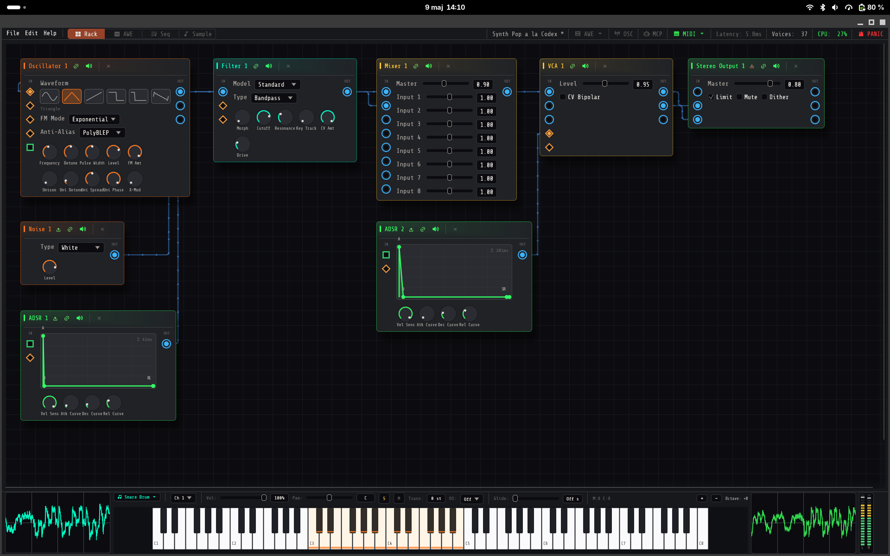

A complete instrument patch: a WaveTable oscillator feeds a Filter, then a
Mixer, then the Stereo output, with an LFO and Envelope driving modulation
inputs.

### `rack-2.png`

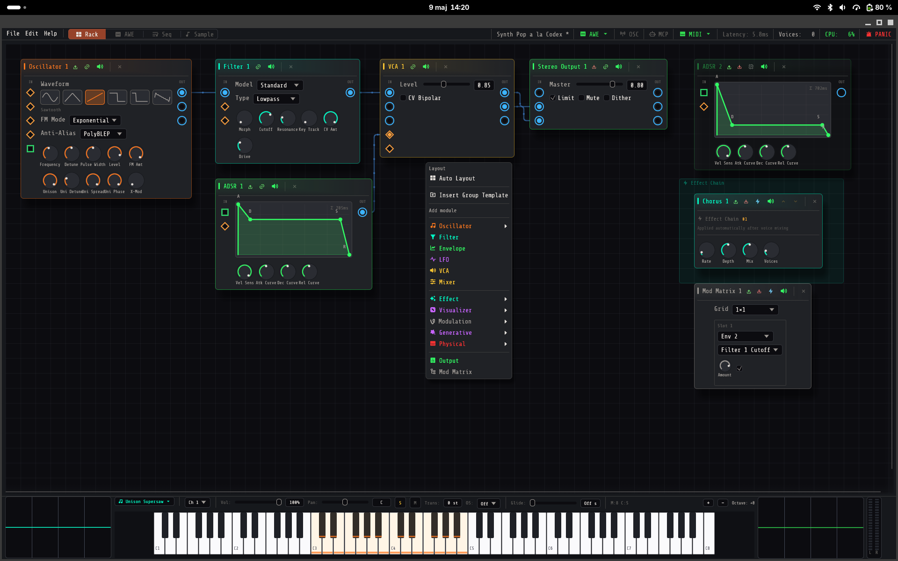

The patch editor with the *Add Module* context menu open, showing the module
categories (Audio, Filter, Envelope, LFO, Mixer, Distortion, Modulation,
Generators, Output, Wav Module).

### `rack-3.png`

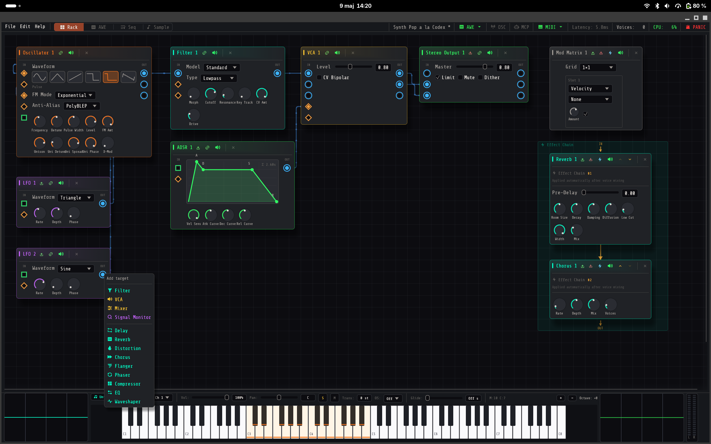

A larger patch with multiple oscillators, filters, an envelope, a Mod Matrix
and a Chorus — illustrating richer modulation routing.

## Mod Matrix — YAMS Control Scripts

### `yams-1.png`

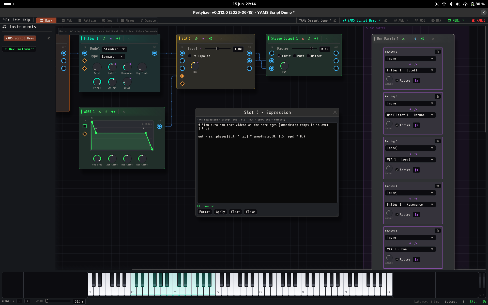

The *YAMS Script Demo* instrument with the Mod Matrix expression editor open. Each
Mod Matrix routing (right-hand panel) can run a small YAMS control script instead of
a scalar amount — the script's `out` value becomes the modulation offset, evaluated
per voice in real time. The popup edits slot 5's script
(`out = sin(phasor(0.3) * tau) * smoothstep(0, 1.5, age) * 0.7`, a note-age auto-pan)
with a live compile status and Format / Apply / Clear / Close buttons. A scripted
routing lights its ƒx marker, and the script reads its sources (LFOs, envelopes,
macros like `velocity`/`age`) straight from the expression.

### `script-1.png`

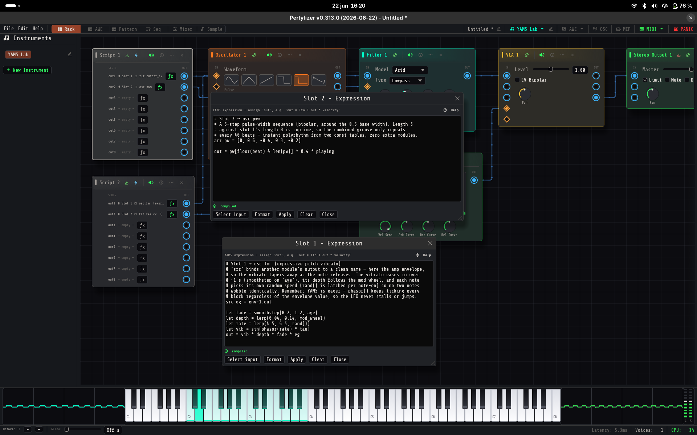

The *YAMS Lab* instrument — a Script (`scr`) module showcase. The voice
(Pulse oscillator → Filter → Mixer → Stereo Output) deliberately has **no LFO**:
every bit of movement comes from two Script modules, each exposing up to eight
YAMS slots on its own output ports. Two expression editors are open side by side.
*Rhythm Brain* (top) is tempo-synced and global — `arr` lookup tables indexed by
the transport `beat` drive an 8-step filter-cutoff sequence and a 5-step
pulse-width sequence, whose coprime lengths give a 40-beat polyrhythm; both are
gated by `playing`. *Voice Motion* (bottom) is per-voice and expressive — a
`src`-bound envelope tapers an `age`/mod-wheel vibrato with a per-note random
rate, while `rand_smooth` adds resonance drift that is decorrelated across
simultaneous voices. Together they exercise most of the language: `src`
bindings, const tables, macros, stateful `phasor`/`rand`/`lag`, and the eager
evaluation model.

## Sequencer / Arrangement

### `seq-1.png`

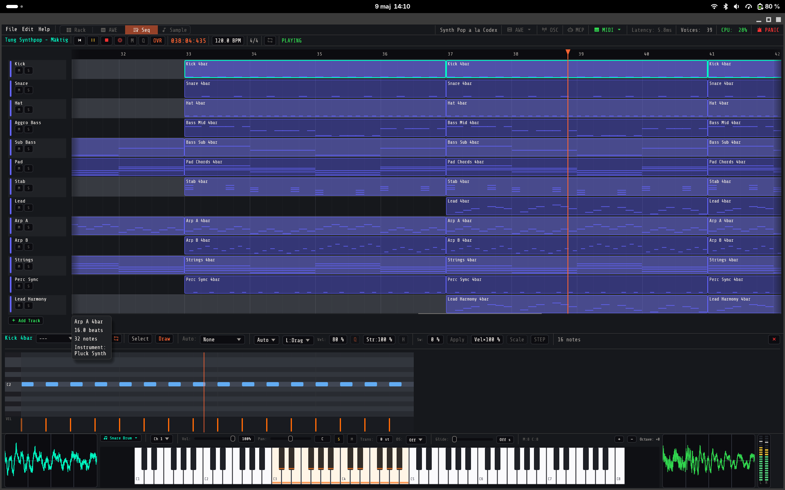

The song arrangement view: tracks (Drums, Bass, Pad, Lead, Strings, etc.)
laid out on a horizontal timeline with their pattern clips, plus a piano-roll
preview of the selected pattern at the bottom.

### `pattern-1.png`

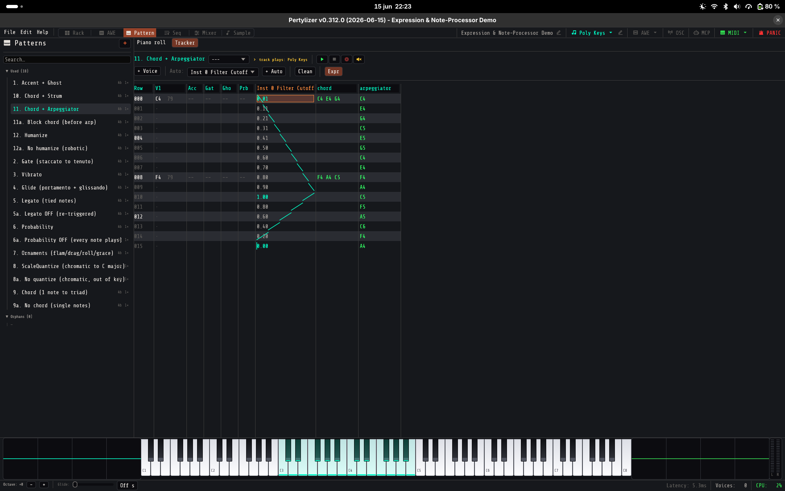

The vertical *Tracker* pattern editor (an alternative to the piano roll, toggled
top-left). The selected pattern is shown as rows of note and voice columns next to
an inline automation lane — here a Filter Cutoff curve (the green V-shape). The
left panel lists the patterns of an *Expression & Note-Processor Demo* song, each
exercising a note processor or per-note expression: arpeggios, ornaments
(flam/drag/ruff/roll), chords, glide, legato, probability, scale-quantize and
humanize.

## Acoustic World Engine (AWE)

### `awe-1.png`

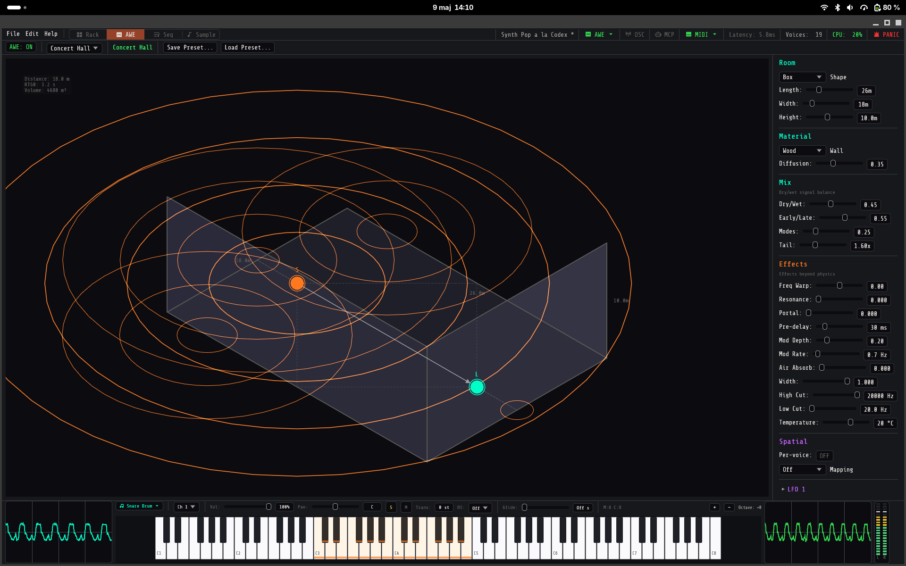

The Acoustic World Engine — a 3D room simulator with a sound source and a
listener positioned in space, showing reflection paths. The right-hand panel
exposes Room dimensions, Material, Mix, Effects and Spatial parameters.

## Visualizer

The realtime 3D audio visualizer with several scenes driven by the audio
stream.

### `visualizer-1.png`

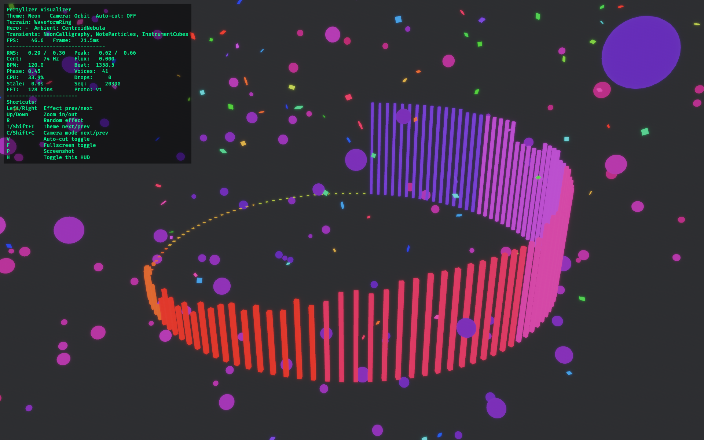

Circular spectrum bars with floating particles, reacting to the frequency
content of the audio.

### `visualizer-2.png`

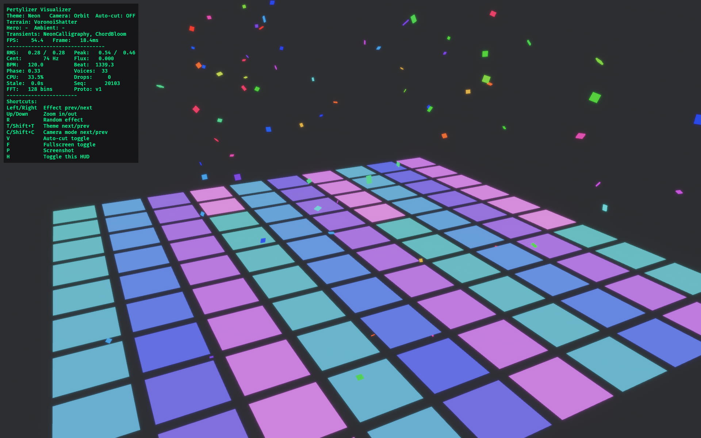

A checkerboard floor scene with confetti particles, modulated by the audio
signal.

### `visualizer-3.png`

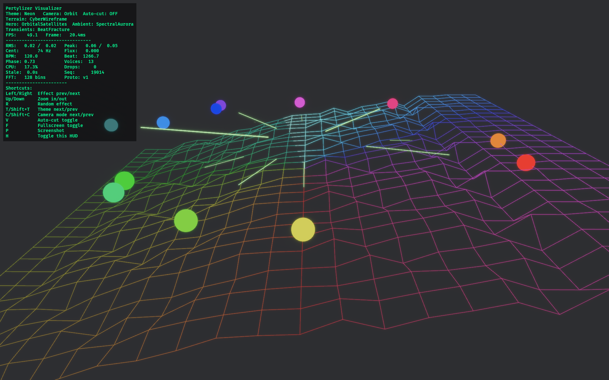

A wireframe terrain that deforms with the audio, with bouncing spheres on top.
